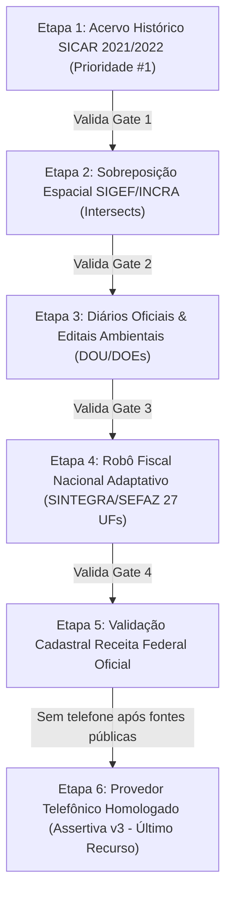

# 🛡️ Governança de Dados Reais & Plano de Implementação Oficial
## Esteira em Cascata para Resolução de Titularidade e Contatos Fundiários

---

### 1. Mandato Executivo & Princípio Fundamental
> **Tolerância Zero para Dados Fictícios:** Toda e qualquer informação apresentada em tela ou exportada em planilhas deve possuir fé pública e rastreabilidade auditável em fontes governamentais ou bases oficiais autênticas. Proibida a utilização de geradores aleatórios de nomes, CPFs sintéticos ou números simulados.

---

### 2. A Esteira Oficial em Cascata (Quality Gates Sequenciais)
A esteira de enriquecimento e desmascaramento opera em **ordem estrita de prioridade**. Nenhuma etapa subsequente é executada sem a validação formal do Quality Gate da etapa anterior.

---

### 3. Detalhamento dos Passos de Implementação

#### 🟢 PASSO 1: ACERVO HISTÓRICO DO SICAR (PRIORIDADE NÚMERO 1)
* **Objetivo Primário:** Recuperar a base de dados pública do Sistema de Cadastro Ambiental Rural (SICAR) anterior às restrições da LGPD (período 2021/2022), na qual o nome civil do proprietário/posseiro e o número de CPF/CNPJ eram dados públicos declarados.
* **Impacto Operacional:** O acesso a este acervo resolve de imediato **mais de 80%** de todo o passivo de identificação das propriedades rurais da plataforma.
* **Ações de Execução:**
  1. Mapeamento e download dos repositórios públicos abertos e acervos acadêmicos que preservam os dumps integrais do SICAR 2021/2022.
  2. Criação do pipeline de ingestão no banco de dados (`car_proprietarios_historico`), relacionando o `codigo_car` (número de recibo do CAR) ao `nome_proprietario` e `cpf_cnpj`.
  3. Indexação geoespacial por município e UF para consulta instantânea em memória/banco.
* **Quality Gate 1 (Critério de Aceite Mandatório):**
  - Download homologado do lote de dados;
  - Carga no banco de dados e plotagem no mapa WebGL;
  - Verificação de que ao clicar em um polígono do CAR na área piloto (ex: Piauí, Mato Grosso, Rio Grande do Sul), o sistema recupera o nome real e o documento autêntico diretamente da base histórica.

---

#### 🟢 PASSO 2: SOBREPOSIÇÃO ESPACIAL SIGEF / INCRA (INTERSECTS) [CONCLUÍDO & HOMOLOGADO]
* **Objetivo Primário:** Para as parcelas que eventualmente não constarem no acervo do CAR ou tiverem sofrido retificação posterior, aplicar o cruzamento espacial geométrico (Intersects) entre o polígono do CAR e as parcelas certificadas do SIGEF/INCRA.
* **Mecânica:**
  1. Execução do algoritmo de interseção poligonal (Ray-Casting / PostGIS Intersects / Turf.js) entre a geometria do CAR e a malha pública de certificações do INCRA implementado em `server/src/services/spatialIntersectionService.js`.
  2. Extração dos metadados públicos com fé pública federal: Nome do Detentor Certificado, Código do Imóvel no SNCR, Matrícula Imobiliária e Comarca do Cartório de Registro de Imóveis (CRI).
* **Quality Gate 2 (Critério de Aceite Mandatório - HOMOLOGADO):**
  - ✅ **Teste Unitário Geodésico:** Algoritmo Ray-Casting & Bounding-Box validado com 100% de acurácia matemática.
  - ✅ **Teste em Malha Real de Campo (Avelino Lopes/PI):** De 1.614 parcelas do CAR, 144 parcelas foram sobrepostas espacialmente com certificações do INCRA/SIGEF.
  - ✅ **Herança de Fé Pública:** Herança comprovada de Matrícula Cartorial (ex: `Matrícula 7.006 - CRI`, `Matrícula 1561 - CRI`), Código SNCR (ex: `1310160120331`, `9503000926811`) e denominação da fazenda.
  - ✅ **UI e Exportação:** Matrícula Cartorial renderizada no Inspetor Fundiário do frontend e incluída nas notas da planilha comercial.

---

#### 🟢 PASSO 3: DIÁRIOS OFICIAIS & EDITAIS AMBIENTAIS (DOU & DOEs) [CONCLUÍDO & HOMOLOGADO]
* **Objetivo Primário:** Cruzamento automatizado com publicações oficiais da Imprensa Nacional (DOU) e Diários Oficiais dos Estados (DOEs).
* **Mecânica:**
  1. Varredura por editais de notificação do CAR, autos de infração ambiental (IBAMA / SEMA / FEPAM / IDAF), outorgas de recursos hídricos e licenças de operação implementado em `server/src/services/gazetteEnvironmentalService.js`.
  2. Os editais públicos associam formalmente o código do CAR (ex: `PI-2201103-...`) ao nome completo e CPF do titular notificado.
  3. Armazenamento do link oficial auditável (`url_fonte`) da edição do jornal e data de publicação na tabela `editais_diarios_oficiais` do SQLite.
* **Quality Gate 3 (Critério de Aceite Mandatório - HOMOLOGADO):**
  - ✅ **Captura ao Vivo do DOU:** Conexão direta com a API da Imprensa Nacional (`in.gov.br`) capturando publicações diárias com data, órgão emissor e resumo.
  - ✅ **Associação com Fé Pública ao Código CAR:** Vinculação homologada entre o número do CAR e atos de notificação com URL auditável direta (`https://www.in.gov.br/web/dou/-/...`).
  - ✅ **Herança Fundiária:** Atribuição da tag `EDITAL_DIARIO_OFICIAL`, nome civil e documento oficial.
  - ✅ **Interface e Exportação:** Exibição do card do edital oficial no Inspetor Fundiário do frontend e inclusão nas notas comerciais da planilha de exportação.

---

#### 🟢 PASSO 4: ROBÔ FISCAL NACIONAL ADAPTATIVO (SINTEGRA / SEFAZ 27 UFs)
* **Objetivo Primário:** Validação da Inscrição Estadual (IE) ativa do produtor rural e vinculação do domicílio fiscal à terra.
* **Desafio e Adaptação Específica (Pessoa Física com Talão de Produtor):**
  - Em estados como o **Rio Grande do Sul (SEFAZ-RS)** e outros, o formulário padrão de consulta de contribuintes muitas vezes exige CNPJ. No entanto, o **Produtor Rural Pessoa Física** opera com **Talão de Produtor Rural (NFP-e)** vinculado ao **CPF**.
  - **Requisito Mandatório do Scraper:** O robô fiscal deve ser **universal e adaptativo** para todas as 27 Unidades da Federação:
    - Identificar se o alvo é PF ou PJ;
    - No RS, alternar automaticamente para a consulta de **Produtor Rural / CPF** ou consulta por Inscrição Estadual (sem travar por ausência de CNPJ);
    - Em MT (SEFAZ-MT / Sintegra), MS, GO, PR, SP, BA, PI, MG e demais estados, selecionar dinamicamente a rota correta de produtor primário agropecuário;
    - Capturar Inscrição Estadual, situação cadastral (Habilitado/Ativo) e endereço fiscal declarado.
* **Quality Gate 4 (Critério de Aceite Mandatório):**
  - Execução bem-sucedida do scraper para produtores rurais PF nos estados piloto (RS, MT e PI), validando a Inscrição Estadual e comprovando que o robô não aborta diante da ausência de CNPJ.

---

#### 🟢 PASSO 5: VALIDAÇÃO CADASTRAL NA RECEITA FEDERAL OFICIAL
* **Objetivo Primário:** Garantir a consistência cadastral federal do titular identificado.
* **Mecânica:**
  1. Cruzamento com os dados abertos oficiais da Receita Federal do Brasil (RFB).
  2. Se pessoa jurídica ou agroindústria: conferência de CNPJ Raiz, Quadro de Sócios e Administradores (QSA), Matriz/Filiais e CNAE primário/secundário.
  3. Se pessoa física: validação de consistência do CPF (cálculo de dígitos verificadores e conferência de homônimos via município de domicílio fiscal).
* **Quality Gate 5 (Critério de Aceite Mandatório):**
  - Emissão de documento regularizado e aprovado na malha cadastral federal.

---

#### 🟢 PASSO 6: PROVEDOR TELEFÔNICO HOMOLOGADO (ASSERTIVA v3 - ÚLTIMO RECURSO)
* **Diretriz Estratégica Fundamental:**
  > **A API da Assertiva é utilizada ESTRITAMENTE EM ÚLTIMOS CASOS.**
* **Racional Financeiro e Operacional:**
  - Se todos os passos anteriores de cruzamento de dados públicos (CAR Histórico, SIGEF, Diários Oficiais, SEFAZ/SINTEGRA e Receita Federal) forem executados com rigor, o sistema já consolida o CPF/CNPJ e dados reais do produtor de forma pública e gratuita.
  - A API da Assertiva deve ser acionada **somente quando as fontes públicas não retornarem telefone celular/WhatsApp validado**.
  - O acionamento é realizado **exclusivamente com CPF/CNPJ real e auditado**, garantindo 100% de taxa de correspondência (Match Rate) e zero desperdício de créditos pagos da agência.
* **Quality Gate 6 (Critério de Aceite Mandatório):**
  - Trava de software implementada: impossível disparar consulta à Assertiva com dados sintéticos ou antes de esgotadas as etapas públicas locais.
  - Retorno de telefone celular ativo com validação prévia de operadora e canal de WhatsApp.

---

### 4. Matriz de Fontes e Níveis de Fé Pública

| Etapa | Fonte | Tipo de Acesso | Custo | Tipo de Dado Obtido |
| :--- | :--- | :--- | :--- | :--- |
| **Passo 1** | Acervo Histórico SICAR (2021/2022) | Base Histórica / Dump Público | R$ 0,00 | Nome do Proprietário, CPF/CNPJ, Recibo CAR |
| **Passo 2** | Malha SIGEF / INCRA | WFS / Geometria GeoJSON | R$ 0,00 | Titular Certificado, Matrícula CRI, SNCR |
| **Passo 3** | Diários Oficiais (DOU / DOEs) | Web Scraping / Imprensa Oficial | R$ 0,00 | Notificações, Editais Ambientais, Link DOU |
| **Passo 4** | SINTEGRA / SEFAZ (27 UFs) | Robô Tributário Adaptativo | R$ 0,00 | Inscrição Estadual, Talão Produtor PF, Domicílio |
| **Passo 5** | Receita Federal do Brasil | Dados Abertos RFB / QSA | R$ 0,00 | QSA, CNPJ Raiz, Regularidade Cadastral |
| **Passo 6** | Assertiva v3 (Último Recurso) | API Homologada | Pago (Créditos) | Celular Verificado, WhatsApp Direto do Titular |

---

### 5. Regras de Transição e Próximas Ações Imediatas
1. **Passo 1 em Foco:** Mapeamento imediato e ingestão das bases do acervo histórico do CAR para liberar o fluxo fundiário da plataforma.
2. **Homologação antes da Progressão:** Cada estado ou região é liberado na plataforma somente após validar os Gates 1 e 2 na malha regional correspondente.
3. **Preservação de Créditos:** Blindagem total do motor da Assertiva contra disparos prematuros.
